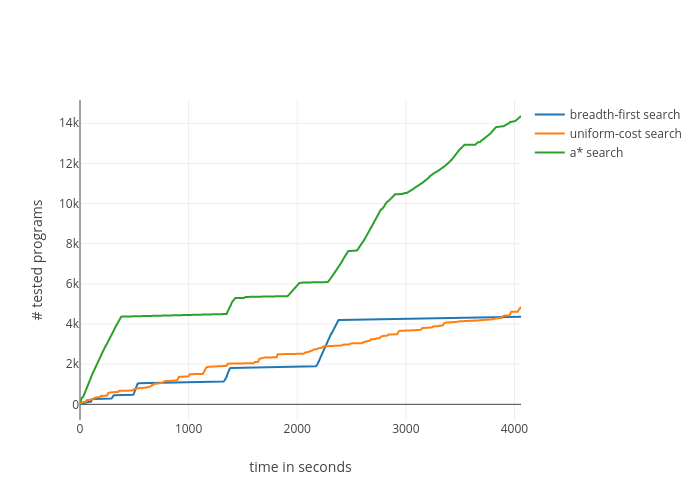

# WHILE Quine

This script uses uniform-cost search on possible abstract syntax trees to find a [Quine](https://en.wikipedia.org/wiki/Quine_(programming)) for the [WHILE programming language](https://github.com/alexj136/HWhile).

## Usage

- `npm run build`: Fetch and build the WHILE binary. Requires the [Haskell Tool Stack](https://docs.haskellstack.org/en/stable/README/).

- `npm start`: Start the program to undertake further attempts at finding a quine. The search tree will be built anew on each start (which is unfortunately extremely slow), but all previous attempts which are saved in `history.csv` will not be executed again. The attempts will be saved to `history.csv`.

- `npm run clean`: Empty the table of previous attempts in `history.csv`. Usually you do not want to run this because you do not want to recompute the whole table.

- Comparison of search algorithms:

  - `npm run compare`: Starts three background threads running breadth-first search, uniform-cost search and A* search, respectively. You will need to kill them manually (by using your process manager or using `kill <PID>` three times), be careful. It would be cool if the background processes could be automatically killed by one single command which could then be put as a script (like `npm run stopall` or so) into `package.json`, please create an issue if you have an idea how to do that.

  - `npm run logcompare`: Periodically log the number of tested programs for each search algorithm to `comparison/log.txt`.

  - `npm run plot`: Transform and plot these time-series logs.

## Comparison of Search Algorithms

## Contributing

It would be cool if you could clone or install the project, run it for a few hours or days, and submit a pull request with your results :)

If you actually find the Quine with this program, you can collect 2.5£ reward from me. This presupposes that you do not before me claim the original 5£ reward set out by a certain undisclosed person.

Also, if you have any suggestions how to improve the script, your issues and pull requests are very welcome!

## ToDo

- Add self-interpreter (and maybe other useful functions) to grammar.
- Testing:
  - Check for duplicates in hash tables. (There should be none.)
- Data analysis:
  - List programs in order of lowest edit distance.

## Manual approach

I had also briefly started to pursue an unsuccessful [manual approach](https://github.com/davidpomerenke/while-quine/quine.md).