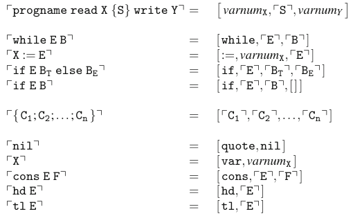

# Searching for the WHILE Quine

The Node Script is unfortunately very slow and, I'm afraid, unlikely to ever find the Quine. So I will try here to find it by hand. The idea is to start with some program, then to create a program to output this program, create another program to create the first program, etc. After a few iterations we will see whether some pattern emerges, and whether we might be able to catch it in a WHILE construct.

## Programs as Data
The general encoding of _programs as data_ is explained in section 6.3, figure 6.2 of [Bernhard Reus, "Limits of Computation"](https://b-ok.cc/book/2741585/dd6957):



It might also be relevant how commands are specifically encoded as integers. This is specified in [the pure WHILE compiler core](https://github.com/alexj136/HWhile/blob/master/src/lib/PureSyntax.hs), l. 150ff:

```haskell
atomToInt :: Atom -> Int
atomToInt atom = case atom of
    AtomAsgn    ->  2
    AtomDoAsgn  ->  3
    AtomWhile   ->  5
    AtomDoWhile ->  7
    AtomIf      -> 11
    AtomDoIf    -> 13
    AtomVar     -> 17
    AtomQuote   -> 19
    AtomHd      -> 23
    AtomDoHd    -> 29
    AtomTl      -> 31
    AtomDoTl    -> 37
    AtomCons    -> 41
    AtomDoCons  -> 43
```

## Iterating

### Basic program
```
test read IgnoreInput {} write X1
```

This translates to:
```
[0, [], 1]
```

### Iteration 1
So let's write a program that outputs this input:
```
test read IgnoreInput {
  X1 := 
    cons nil
    cons nil
    cons 1
    nil
} write X1
```

Which is, as data:
```
[ 0
, [ 2
  , nil
  , [ 41
    , nil
    , [ 41,
      , nil
      , [ 41,
        , 1
        , nil
        ]
      ]
    ]
  ]
, 1
]
```

This is quite ugly, so from now let's leave out the commas and brackets (the result is still unambiguous):
```
0
  2
  1
  41
    nil
    41
      nil
      41
        1
        nil
1
```

### Iteration 2
Let's write a program to encode that:
```
test read IgnoreInput {
  X1 := 
    cons nil
    cons
      cons 2
      cons nil
      cons
        cons 41
        cons nil
        cons
          cons 41
          cons nil
          cons
            cons 41
            cons 1
            nil
          nil
        nil
      nil
    cons 1
    nil
} write X1
```

As data:
```
...
```

